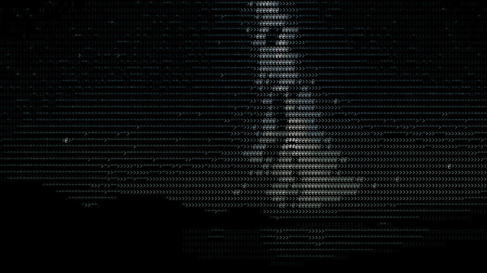

<h2 align="center">
  
</h2>

<h3 align="center">
  5TH YEAR EPITECH STUDENT BASED IN PARIS ٩(ˊᗜˋ*)و
</h3>

---

  <b>Hi, I'm druksx!</b>  
  Fast learner, analytical thinker, passionate about building elegant and robust software.

---

## 🚀 About Me

- 🎓 **Master in Computer Science @ EPITECH Paris**  
  Currently in my final year, with international experience at Griffith College Dublin.
- 🌍 Based in Paris, open to global opportunities & collaborations.
- 🧠 Rapid adaptability to new technologies and environments.
- 🛠️ Strong analytical skills & product sense, always striving for user-centric solutions.

---

## 💻 Tech Stack & Tools

  
  <!-- Programming Languages -->
  
  
  
  
  
  
   
  <!-- Web & Frameworks -->
  
  
  
  
  
   
  <!-- DevOps & Containers -->
  
  
  
   
  <!-- Tools -->
  
  
  
  
  
  

---

## 🎯 Strengths

- **Rapid Learning:** Easily adapts to new tools and languages.
- **Analytical Mindset:** Skilled in breaking down complex problems for simple, robust solutions.
- **Product Focused:** Delivers features that are relevant, useful, and well-integrated for users.

---

## 📫 Contact

Feel free to reach out for collaborations, internships, or just to say hi!

  <a href="mailto:aurelien.leclercq@epitech.eu">Email</a> &nbsp;•&nbsp;
  <a href="https://www.linkedin.com/in/aurelien-leclercq/">LinkedIn</a>

