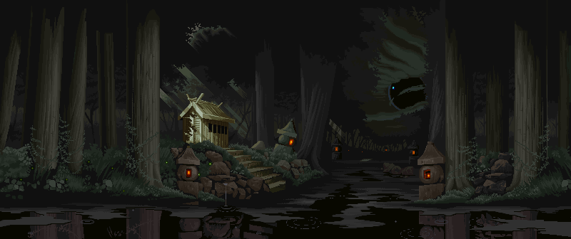
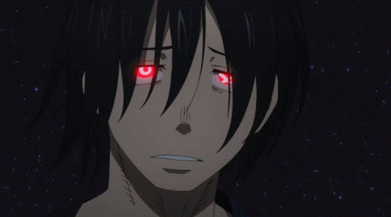

<h2 align = "center ">
  
</h2>
<h2 align = "left">
  
</h2>

  Hi, my name is Aurélien, and I am C programmer based in Paris. 💻
   I am currently studying at Epitech Paris for my first year. 📚
   As a normal human, I like playing videogames, eating, sleeping and watching animes.
   By the way ! Here is one of my favorite anime characters : 
<h2 align = "center">
  
</h2>

<h2 align = "left">
  
</h2>

  

  

<h2 align = "left">
    
</h2>
